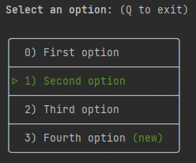

# shell-menu-select

A script that allows a user to use arrow keys to select an item from a list. Sometimes using `select` can be a bit clunky because the user doesn't get any visual feedback about what they're selecting unless a confirmation message is displayed (which adds more overhead).

### New features
1. Table style menu
2. Added `selectedChoiceIndex` to store index of the selected option
3. Added the possibility to type number to select an option
4. Added the possibility to quit typing 'q'
5. Improved handling of other keys different from arrow keys or numbers
6. Improved handling of colored options
7. Improved performance

---

## How to load

Typical (you have the script locally)
```sh
source ./get-choice.sh
```

Remote (you want the functionality, but don't want to clone or copy anything)
```sh
source <(wget -qO- https://raw.githubusercontent.com/PuffoCyano/shell-menu-select/master/get-choice.sh)
# or
source <(curl -s https://raw.githubusercontent.com/PuffoCyano/shell-menu-select/master/get-choice.sh)
# or
source /dev/stdin <<< "$(curl -s "https://raw.githubusercontent.com/PuffoCyano/shell-menu-select/master/get-choice.sh")"
```

---

## How to use

All flags and an example are demonstrated via the `--help` command.

```sh
source ./get-choice.sh
getChoice -h
```

## Example
```sh
options=("First option"
          "Second option"
          "Third option"
          "Fourth option \033[0;31m(new)\033[0m")
getChoice -q "Select an option:" -o options
echo -e "Option $selectedChoice with index $selectedChoiceIndex"
```
